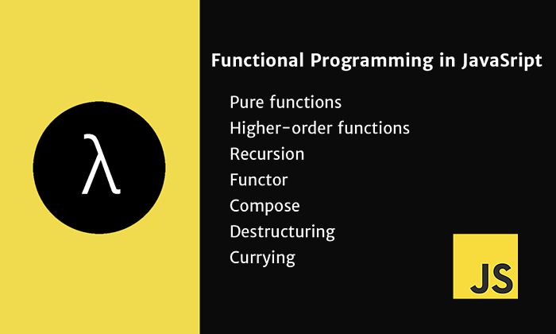
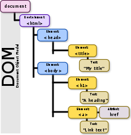

# KATAS

Single project to the aim to practice some programming exercises.

* Kata to test the typical function methods in a collection
* Kata to test how to load the DOM tree dynamically

## functional programming



Functional Programming in JavaScript
Functional programming is a programming paradigm that treats computation as the evaluation of mathematical functions and avoids changing-state and mutable data.

To run the tests and see how the kata is working
```
npm install
npm run test
```


## DOM: load the DOM tree dynamically using JS, injecting components in the dom tree.

In the resources folder you can see the HTML's files where the kata is done.

* DynamicContent.html: adding an paragraph to the DOM tree dynamically
* Template.html: adding dynamic content to the DOM tree using html x-templates



